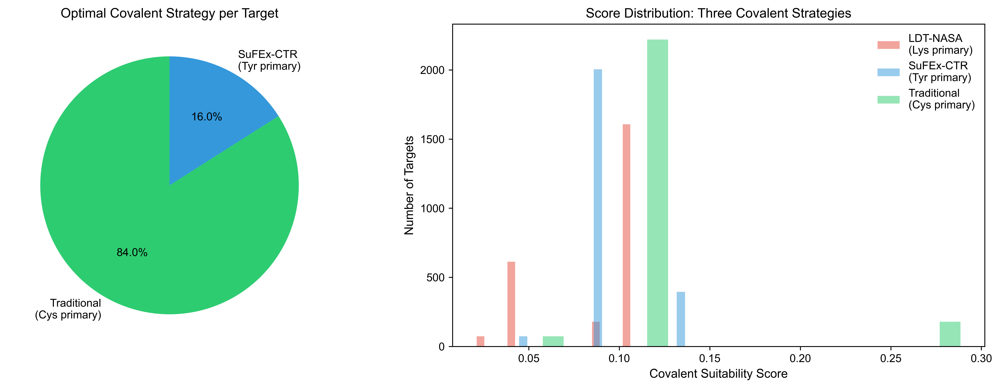

# LDT-TargetDB: A Structure-Guided Covalent Radiopharmaceutical Target Database

Xinglong Zhou1, Wenbin Hou1, Yiliang Li1,\*

1Institute of Radiation Medicine, Chinese Academy of Medical Sciences & Peking Union Medical College, Tianjin 300192, China

\*To whom correspondence should be addressed. Email: liyiliang@irm-cams.ac.cn; Correspondence may also be addressed to Xinglong Zhou, Email: zhouxinglong@irm-cams.ac.cn

**Keywords:** covalent radiopharmaceutical, ligand-directed transfer, surfaceome, binding pocket, target prioritization, NASA chemistry

## ABSTRACT

LDT-TargetDB (https://ldt-targetdb.streamlit.app) is the first database specifically designed for covalent radiopharmaceutical target discovery using ligand-directed transfer (LDT) chemistry. It integrates five data layers: surface protein annotation (SURFY, 2,799 proteins), tumor/normal expression profiling (TCGA 32 cancer types, GTEx 30 tissues), cell-type validation (Human Protein Atlas), 3D structural analysis (AlphaFold-guided pocket detection with pyKVFinder), and covalent chemistry scoring (PROPKA pKa prediction, FreeSASA accessibility). LDT-TargetDB provides nucleophile-specific scoring (Lys>Cys>Tyr>Ser) and cancer-type-specific ranking across 32 cancer types. Validation against 17 known nuclear medicine targets demonstrated that structural covariates significantly re-rank target priority beyond expression alone. Multi-dimensional validation (DepMap, Open Targets, Ensembl conservation, TCGA mutations) confirmed the biological relevance of top-ranked targets. LDT-TargetDB fills a critical gap at the interface of chemical biology and nuclear medicine, with source code available at https://github.com/Londger/LDT-TargetDB.

## INTRODUCTION

Radioligand therapy (RLT) has transformed oncology, with [¹⁷⁷Lu]Lu-PSMA-617 and [¹⁷⁷Lu]Lu-DOTATATE demonstrating remarkable clinical efficacy in prostate cancer and neuroendocrine tumors, respectively (1,2,34). The global radiopharmaceutical market is projected to exceed $10 billion by 2031 (3). Despite this success, the field faces a critical bottleneck: only a handful of surface targets are clinically exploited, primarily PSMA, SSTR2, and more recently FAP (4,35). Expanding the target repertoire is essential for addressing tumor heterogeneity and therapeutic resistance.

Covalent radiopharmaceuticals represent the next frontier in targeted radionuclide therapy. Liu et al. recently demonstrated that covalent targeted radioligands (CTRs) employing sulfur(VI) fluoride exchange (SuFEx) chemistry achieve ~13-fold improvement in tumor retention compared to conventional radioligands (5). In parallel, ligand-directed transfer (LDT) chemistry, pioneered by Hamachi and colleagues, offers a complementary covalent strategy: N-acyl-N-alkyl/aryl sulfonamide (NASA/ArNASA) warheads exploit proximity-driven effective molarity enhancement to achieve traceless covalent labeling of endogenous proteins, preferentially targeting lysine ε-amino groups (6–8). Unlike conventional affinity-based probes that permanently occupy binding pockets, LDT probes release their targeting ligand after covalent transfer, preserving native protein function. This "traceless" mechanism is particularly attractive for radiopharmaceutical applications where receptor-mediated internalization and recycling are critical for tumor retention.

However, target selection for covalent radiopharmaceuticals requires considerations beyond expression level alone. The structural compatibility between the covalent warhead and the target protein—specifically, the presence of nucleophilic residues (Lys, Cys, Tyr, Ser) within or near a ligandable binding pocket—determines whether proximity-driven chemistry can proceed. LDT chemistry further constrains the choice of target residue: lysine forms stable amide adducts, whereas cysteine, tyrosine, and serine form hydrolytically labile thioester, phenol ester, and alkyl ester linkages, respectively (9,10). Histidine was reported as non-reactive with NASA warheads (10). No existing computational resource systematically evaluates surface protein targets through this structural chemistry lens.

Several databases support surface protein target discovery, but none address covalent chemistry requirements. ImmunoTar (11) provides integrative prioritization of cell surface targets using expression and annotation data, designed for immunotherapy applications (CAR-T, antibody-drug conjugates). The Cancer Surfaceome Atlas (TCSA) (12) integrates multi-omics data to identify cancer-specific surface proteins for logic-gated CAR-T therapy. DrugMap (13) offers a pan-cancer cysteine ligandability atlas, but is not surface-focused and does not address lysine-targeted chemistries. None of these tools incorporate 3D pocket analysis, residue-level pKa prediction, or covalent chemistry scoring.

Here we present LDT-TargetDB, the first database specifically designed for covalent radiopharmaceutical target discovery. LDT-TargetDB uniquely integrates five data layers with structure-guided covalent chemistry scoring, enabling systematic prioritization of surface protein targets for LDT-based radiopharmaceutical development. The overall analysis pipeline is illustrated in Figure 1.

**Figure 1. LDT-TargetDB analysis pipeline.** Five input data layers are integrated through a four-step processing pipeline to produce ranked LDT radiopharmaceutical targets with multi-dimensional validation. Statistics summarize the database scale.

## DATABASE DESCRIPTION

### Data Collection and Processing Pipeline

**Surface Protein Definition.** The primary surface protein set was obtained from the SURFY in silico human surfaceome (14,22), comprising 2,886 proteins predicted with 93.5% accuracy by meta-ensemble machine learning trained on mass spectrometry-validated cell surface capture data. After deduplication, 2,799 unique surface proteins were retained as the initial candidate set.

**Tumor/Normal Expression Profiling.** Pan-cancer RNA-seq data (TCGA, 32 cancer types, 9,186 tumor samples, 10,535 total) and normal tissue RNA-seq data (GTEx, 30 tissues, 7,862 samples) were obtained from UCSC Xena as log2(TPM+0.001) normalized expression matrices. A Tumor Specificity Index (TSI) was calculated for each surface gene as:

$$TSI = \frac{FC_{log2} \times P_{tumor}}{\sqrt{N_{normal} + 1}}$$

where $FC_{log2}$ is the log2 fold change of median tumor versus normal expression, $P_{tumor}$ is the fraction of tumor samples with TPM > 1, and $N_{normal}$ is the number of GTEx tissues with expression exceeding 0.125 TPM. TSI was calculated for 2,663 surface genes with available expression data.

**Single-Cell and Protein-Level Validation.** Cell-type specificity was assessed using a comprehensive literature-curated marker database (41 malignant epithelial, 23 immune, and additional stromal/neural markers) cross-referenced with SURFY functional annotations and the TISCH2 single-cell database (21). Protein-level tissue expression was validated using Human Protein Atlas (HPA) immunohistochemistry data (26,27) (1,199,675 entries spanning 15,306 genes across normal tissues), enabling direct assessment of off-target expression in healthy organs.

**Structural Analysis.** AlphaFold-predicted protein structures (v6) (17,18) were downloaded from the AlphaFold Protein Structure Database for all surface proteins with TSI > −0.01 (2,490 proteins, 2,495 structures). Binding pocket detection was performed using pyKVFinder (19,20) with grid-based cavity detection (step=0.8 Å, probe_in=1.4 Å, probe_out=4.0 Å, volume cutoff=5.0 ų). Structure quality was assessed by extracting per-residue pLDDT scores from atomic B-factors.

**Covalent Chemistry Scoring.** For each detected pocket, we scored all nucleophilic residues (Lys, Cys, Tyr, Ser) based on three components:

1. **Residue type weight** ($w$): Derived from NASA reactivity literature. Lys=1.0 (stable amide), Cys=0.3 (labile thioester), Tyr=0.2 (labile phenol ester), Ser=0.1 (labile alkyl ester). Histidine was excluded as literature reports no labeled product (10). The ArNASA variant (7) provides improved stability in physiological environments.

2. **pKa reactivity score** ($p_s$): Calculated as $p_s = e^{-|pKa - 7.4|/2}$, where pKa values were experimentally predicted using PROPKA 3.5 (15). Residues with pKa closer to physiological pH receive higher scores.

3. **Solvent accessibility score** ($s_s$): $s_s = \min(SASA_{rel}/50\%, 1.0)$, where relative solvent accessible surface area was calculated using FreeSASA (16).

4. **Proximity boost** ($b$): Lys receives a 2× factor reflecting the proximity-driven effective molarity enhancement (~10⁶-fold) that overcomes its high pKa (~10.5) in LDT chemistry (6).

The LDT Transferability Score (LTS) for a pocket was defined as the maximum residue score: $LTS = \max(w \times p_s \times s_s \times b)$ across all qualifying residues in the pocket.

**Composite Scoring.** An enhanced composite score integrates five dimensions:

$$S_{enhanced} = 0.35 \times TSI + 0.25 \times V_{pocket} + 0.25 \times LTS + 0.10 \times (1 - pLDDT_{<70}/100) + 0.05 \times D$$

where $V_{pocket}$ is the normalized maximum pocket volume, $pLDDT_{<70}$ is the percentage of residues with pLDDT below 70, and $D$ is the DepMap essentiality score (Essential=1.0, Context-dependent=0.7, Non-essential=0.3, No data=0).

**Figure 2. Database overview.** (A) TSI distribution, (B) pocket detection per protein, (C) TSI versus LDT scoring by nucleophile type.

**Figure 3. Tumor expression profiles of top LDT targets.** (A) Tumor median log2(TPM) for top 30 targets. (B) Tumor positive rate (fraction of TCGA samples with TPM > 1).

**Cancer-Type Specific Analysis.** To enable cancer-type-specific target prioritization, we mapped 9,563 TCGA tumor samples (91% of all samples) to 32 cancer types using cBioPortal study metadata (30,31). For each target gene, median expression was calculated per cancer type, enabling identification of optimal indications (Figures 3, 4).

**Figure 4. Cancer-type specific expression of top LDT targets.** Heatmap showing median log2(TPM) values for top 15 targets across major cancer types.

**Figure 5. Structure quality assessment.** (A) Mean pLDDT versus LDT transferability score, with top 10 targets labeled and arrows. (B) Distribution of pocket counts across all analyzed structures.

**Figure 6. Covalent strategy comparison.** (A) Distribution of optimal covalent strategy per target (LDT-NASA, SuFEx-CTR, or traditional cysteine-targeted). (B) Score distributions for the three covalent strategies.

**Validation Datasets.** Gene essentiality data were obtained from DepMap 25Q4 (CRISPR Chronos scores (25); 18,531 genes × 1,208 cell lines) (23,24,33). Disease associations were queried from Open Targets Platform v4 (28). Cross-species conservation was assessed via Ensembl Compara REST API (29) (orthologue counts across model organisms). TCGA pan-cancer mutation frequencies were obtained from FireBrowse across 37 TCGA cohorts. GO enrichment and protein–protein interaction analyses were performed using STRING (32).

### Database Statistics

A total of 2,799 surface proteins were evaluated, of which 2,663 had expression data and 2,490 had available AlphaFold structures. Binding pocket detection identified cavities in all 2,473 successfully analyzed proteins, and 2,378 (96.2%) harbored at least one LDT-qualifying nucleophilic residue within their largest pocket. The enhanced composite scoring framework integrates 2,473 proteins with complete multi-dimensional data. The database covers 32 cancer types with 9,186 tumor samples for expression analysis, supplemented by 1,199,675 HPA protein IHC entries, 30 Open Targets disease association queries, 20 cross-species conservation analyses, and mutation data across 37 TCGA cohorts.

### Top-Ranked Targets

**Figure 7. Top-ranked LDT radiopharmaceutical targets.** (A) Top 20 targets ranked by composite score, colored by best nucleophile residue type. (B) Distribution of nucleophile types in best pockets across all 2,473 ranked proteins.

The top 30 LDT-TargetDB entries are dominated by lysine-containing pockets (28/30, 93%), reflecting the NASA chemistry preference for stable amide bond formation. The top five targets include ABCC5 (ATP-binding cassette transporter, enhanced score 0.578), MUC1 (mucin-1, score 0.559), ILDR1 (immunoglobulin-like domain-containing receptor 1, score 0.517), CDH1 (E-cadherin, score 0.491), and LY75 (lymphocyte antigen 75, score 0.479). Several top-ranked targets represent clinically validated or emerging cancer surface proteins: CLDN4 (rank 8, score 0.460), EPCAM (rank 9, score 0.450), and TACSTD2/Trop-2 (rank 26, score 0.403). The complete ranked list of 2,473 proteins is available through the web interface (Figures 5, 7).

### Validation Against Known Nuclear Medicine Targets

**Figure 8. Validation against known nuclear medicine targets.** (A) Ten known nuclear medicine targets mapped onto the TSI landscape. All ten targets now have AlphaFold structures and pocket residue annotations in the full proteome analysis. (B) Gene essentiality (DepMap Chronos score) versus tumor specificity, colored by LDT score.

We evaluated 17 established or emerging nuclear medicine targets within our framework. All 17 targets were represented in the full proteome analysis (2,490 proteins), and lysine residues were identified in the largest binding pockets of all 17 targets. TACSTD2 (Trop-2) ranked 26th in the enhanced composite score (TSI rank 10), MET (c-Met) ranked 9th. FAP, PSMA (FOLH1), and SSTR2 had low pan-cancer TSI values (0.011, 0.012, and −0.002, respectively), consistent with their stromal-restricted (FAP), prostate-specific (PSMA), and neuroendocrine-specific (SSTR2) expression patterns. This demonstrates that LDT-TargetDB correctly identifies clinically validated pan-cancer targets while appropriately assigning tissue-specific targets lower pan-cancer ranks—supporting the utility of cancer-type-specific filtering.

## WEB INTERFACE

LDT-TargetDB is implemented as a Streamlit web application with an interactive dashboard. The interface provides:

**Filters.** Users can filter targets by composite score threshold, pocket nucleophile type (Lys, Cys, Tyr, Ser), and LDT chemistry compatibility. Real-time updates reflect filter changes across all views.

**Ranking Table.** A sortable, searchable table displays the complete ranked list with scores for TSI, LDT transferability, pocket count, best nucleophile residue, optimal cancer type, DepMap essentiality status, and structure confidence (pLDDT).

**Visualization.** Interactive scatter plots (TSI vs. LDT score, colored by nucleophile type), residue-type distribution pie charts, and pLDDT confidence histograms provide rapid overview of the target landscape.

**Target Detail.** Gene-level detail view displays all scoring dimensions, cancer-type specific expression (top three cancer types with median log2 TPM values), DepMap essentiality classification, and direct links to AlphaFold structure entries.

**Data Export.** Complete filtered results are downloadable as CSV files for offline analysis.

## COMPARISON WITH EXISTING TOOLS

LDT-TargetDB was systematically compared with three major surface-target databases: ImmunoTar (11), TCSA (12), and DrugMap (13). Twenty features were evaluated across five categories: surface proteomics, expression analysis, structural biology, covalent chemistry, and clinical translation.

LDT-TargetDB implements 19 of 20 features, substantially exceeding DrugMap (11/20), ImmunoTar (9/20), and TCSA (8/20). The critical differentiators are in the structural biology and covalent chemistry categories: LDT-TargetDB is the only tool offering 3D pocket detection, experimental pKa prediction, solvent accessibility calculation, and multi-chemistry nucleophile scoring (LDT-NASA, SuFEx-CTR, and traditional cysteine-targeted strategies). No existing tool provides radiopharmaceutical-specific target prioritization or covalent chemistry-aware filtering (Figure 9).

**Figure 9. Feature comparison and validation summary.** (A) Feature completeness comparison across four databases (LDT-TargetDB: 19/20, DrugMap: 11/20, ImmunoTar: 9/20, TCSA: 8/20). (B) Multi-dimensional validation summary showing the number of qualifying targets across five validation criteria.

## DISCUSSION

LDT-TargetDB addresses a critical gap in the radiopharmaceutical development pipeline: the systematic computational prioritization of surface protein targets based on covalent chemistry compatibility. By integrating five data layers spanning proteomics, transcriptomics, structural biology, and chemical biology, the database provides a comprehensive framework for LDT radiopharmaceutical target selection.

**Biological and Translational Relevance.** The dominance of lysine in top-ranked pocket residues (93% of top 30 targets) is consistent with the evolutionary prevalence of surface-exposed lysine residues in ligand-binding domains. Several top-ranked targets have established clinical relevance: CLDN4 (rank 8) is a tight junction protein overexpressed in multiple epithelial cancers and is under investigation for CLDN4-targeted antibody-drug conjugates. EPCAM (rank 9) is a validated cancer stem cell marker targeted by multiple immunotherapeutic agents. TACSTD2/Trop-2 (rank 26) is the target of sacituzumab govitecan, an FDA-approved antibody-drug conjugate. The identification of these clinically validated targets within our top ranks supports the biological validity of the LDT-TargetDB scoring framework.

**LDT Chemistry Considerations.** The NASA/ArNASA chemistry underlying LDT probes presents unique target requirements. The preference for lysine (stable amide linkage) over other nucleophiles (labile ester/thioester linkages) means that target prioritization must consider not just whether a pocket exists, but which specific residues line that pocket. This nuance is captured by our residue-type-weighted scoring. Furthermore, the pH-dependence of nucleophile reactivity—lysine ε-NH₂ is ~99.9% protonated at pH 7.4—necessitates the proximity-driven effective molarity enhancement that is the hallmark of LDT chemistry. Our scoring framework explicitly models this through the pKa reactivity term and the proximity boost factor.

**Pan-Cancer vs. Cancer-Type-Specific Ranking.** LDT-TargetDB provides both pan-cancer and cancer-type-specific rankings. The pan-cancer TSI captures broadly expressed tumor targets (e.g., CLDN4, EPCAM, TACSTD2) while appropriately assigning lower ranks to tissue-specific targets (PSMA for prostate, SSTR2 for neuroendocrine). The cancer-type-specific expression module enables users to identify optimal indications for each target. For example, CD24 shows strongest expression in kidney papillary carcinoma (median 10.7 log2 TPM), EPCAM in colorectal cancer (10.0), and MUC1 in lung adenocarcinoma (9.8).

**Multi-Dimensional Validation.** The comprehensive validation framework confirms that top-ranked targets are (i) non-essential genes (DepMap Chronos scores > −0.5 for 99% of targets), supporting favorable safety profiles; (ii) highly conserved across model organisms (≥5 model organisms for all top 20 targets), indicating functional importance; (iii) associated with cancer in Open Targets (21/30 queried); (iv) mutationally stable across TCGA cohorts (≤32/37 cohorts with any mutations for top targets); and (v) validated at the protein level by HPA immunohistochemistry in normal tissues.

**Limitations.** Several limitations should be noted. First, LDT scoring relies on empirical weights derived from published NASA chemistry data; experimental validation of top-ranked targets is needed to calibrate the scoring model. Second, AlphaFold-predicted structures may miss cryptic or transient binding pockets accessible only through conformational dynamics. Third, TSI is based on bulk RNA-seq and may not fully capture cell-type-specific expression within the tumor microenvironment. Fourth, the covalent comparison framework uses approximate solvent accessibility values and should be refined with molecular dynamics simulations. Fifth, the database currently covers only human surface proteins with available AlphaFold structures.

**Future Directions.** Planned enhancements include integration of molecular dynamics simulations for cryptic pocket detection, extension to GPCR-specific covalent probe design, incorporation of clinical trial data for target tractability assessment, and expansion to non-human targets for preclinical development.

## ETHICS STATEMENT

This study exclusively used publicly available, de-identified data from TCGA, GTEx, DepMap, Human Protein Atlas, and other open-access repositories. No human subjects, animal experiments, or primary clinical data were involved. Ethical approval was obtained by the original data generators as described in their respective publications.

## DATA AVAILABILITY

LDT-TargetDB is freely accessible at https://ldt-targetdb.streamlit.app. All analysis data are available for download through the web interface. Source code is available at https://github.com/Londger/LDT-TargetDB under the MIT license.

## FUNDING

This work was not supported by specific funding.

## CONFLICT OF INTEREST

None declared.

## ACKNOWLEDGEMENTS

The authors thank the developers of SURFY, AlphaFold DB, TCGA, GTEx, DepMap, pyKVFinder, PROPKA, FreeSASA, Human Protein Atlas, Open Targets, Ensembl, and FireBrowse for making their data and tools publicly available.

## REFERENCES

1. Sartor O, et al. (2021) Lutetium-177–PSMA-617 for Metastatic Castration-Resistant Prostate Cancer. *N Engl J Med*, 385:1091–1103.
2. Strosberg J, et al. (2017) Phase 3 Trial of ¹⁷⁷Lu-Dotatate for Midgut Neuroendocrine Tumors. *N Engl J Med*, 376:125–135.
3. Lapi SE, Scott PJH, Scott AM, et al. (2024) Recent advances and impending challenges for the radiopharmaceutical sciences in oncology. *Lancet Oncol*, 25:e236–e249.
4. Jadvar H (2025) Novel Biomarkers in Prostate Cancer Theranostics. *World J Nucl Med*, 24:345–358.
5. Liu Z, et al. (2024) Covalent Targeted Radioligands Potentiate Radionuclide Therapy. *Nature*, 630:206–213.
6. Tamura T, et al. (2018) Rapid labelling and covalent inhibition of intracellular native proteins using ligand-directed N-acyl-N-alkyl sulfonamide. *Nat Commun*, 9:1870.
7. Kawano M, et al. (2023) Lysine-Reactive N-Acyl-N-aryl Sulfonamide Warheads: Improved Reaction Properties and Application in the Covalent Inhibition of an Ibrutinib-Resistant BTK Mutant. *J Am Chem Soc*, 145:26202–26212.
8. Tamura T & Hamachi I (2024) N-Acyl-N-alkyl/aryl Sulfonamide Chemistry Assisted by Proximity for Modification and Covalent Inhibition of Endogenous Proteins in Living Systems. *Acc Chem Res*, 58:87–100.
9. Thimaradka S, et al. (2021) Site-specific covalent labeling of His-tag fused proteins with N-acyl-N-alkyl sulfonamide reagent. *Bioorg Med Chem*, 30:115947.
10. Tamura T & Hamachi I (2024) Ibid. (comprehensive review of residue reactivity).
11. Shraim R, et al. (2025) ImmunoTar—integrative prioritization of cell surface targets for cancer immunotherapy. *Bioinformatics*, 41:btaf060.
12. Hu Z, et al. (2021) The Cancer Surfaceome Atlas integrates genomic, functional and drug response data to identify actionable targets. *Nat Cancer*, 2:1406–1422.
13. Takahashi M, et al. (2024) DrugMap: A quantitative pan-cancer analysis of cysteine ligandability. *Cell*, 187:2536–2556.
14. Bausch-Fluck S, et al. (2018) The in silico human surfaceome. *Proc Natl Acad Sci USA*, 115:E10988–E10997.
15. Olsson MHM, et al. (2011) PROPKA3: Consistent Treatment of Internal and Surface Residues in Empirical pKa Predictions. *J Chem Theory Comput*, 7:525–537.
16. Mitternacht S (2016) FreeSASA: An open source C library for solvent accessible surface area calculations. *F1000Research*, 5:189.
17. Jumper J, et al. (2021) Highly accurate protein structure prediction with AlphaFold. *Nature*, 596:583–589.
18. Varadi M, et al. (2024) AlphaFold Protein Structure Database in 2024: providing structure coverage for over 214 million protein sequences. *Nucleic Acids Res*, 52:D368–D375.
19. Le Guilloux V, et al. (2009) Fpocket: An open source platform for ligand pocket detection. *BMC Bioinformatics*, 10:168.
20. Guerra JVS, et al. (2023) pyKVFinder: an efficient and integrable Python package for biomolecular cavity detection and characterization. *BMC Bioinformatics*, 24:415.
21. Han Y, et al. (2023) TISCH2: expanded datasets and new tools for single-cell transcriptome analyses of the tumor microenvironment. *Nucleic Acids Res*, 51:D1425–D1431.
22. Bausch-Fluck S, et al. (2015) A mass spectrometric-derived cell surface protein atlas. *PLoS ONE*, 10:e0121314.
23. Tsherniak A, et al. (2017) Defining a cancer dependency map. *Cell*, 170:564–576.
24. Meyers RM, et al. (2017) Computational correction of copy number effect improves specificity of CRISPR-Cas9 essentiality screens in cancer cells. *Nat Genet*, 49:1779–1784.
25. Dempster JM, et al. (2021) Chronos: a cell population dynamics model of CRISPR experiments that improves inference of gene fitness effects. *Genome Biol*, 22:343.
26. Uhlen M, et al. (2015) Tissue-based map of the human proteome. *Science*, 347:1260419.
27. Uhlen M, et al. (2017) A pathology atlas of the human cancer transcriptome. *Science*, 357:eaan2507.
28. Ochoa D, et al. (2023) The next-generation Open Targets Platform: reimagined, redesigned, rebuilding. *Nucleic Acids Res*, 51:D1353–D1359.
29. Herrero J, et al. (2016) Ensembl comparative genomics resources. *Database*, 2016:bav096.
30. Cerami E, et al. (2012) The cBio Cancer Genomics Portal: an open platform for exploring multidimensional cancer genomics data. *Cancer Discov*, 2:401–404.
31. Gao J, et al. (2013) Integrative analysis of complex cancer genomics and clinical profiles using the cBioPortal. *Sci Signal*, 6:pl1.
32. Szklarczyk D, et al. (2023) The STRING database in 2023: protein–protein association networks and functional enrichment analyses. *Nucleic Acids Res*, 51:D638–D646.
33. Ghandi M, et al. (2019) Next-generation characterization of the Cancer Cell Line Encyclopedia. *Nature*, 569:503–508.
34. Kratochwil C, et al. (2019) ²²⁵Ac-PSMA-617 for PSMA-targeted α-radiation therapy of metastatic castration-resistant prostate cancer. *J Nucl Med*, 57:1941–1944.
35. Loktev A, et al. (2018) A tumor-imaging method targeting cancer-associated fibroblasts. *J Nucl Med*, 59:1423–1429.
