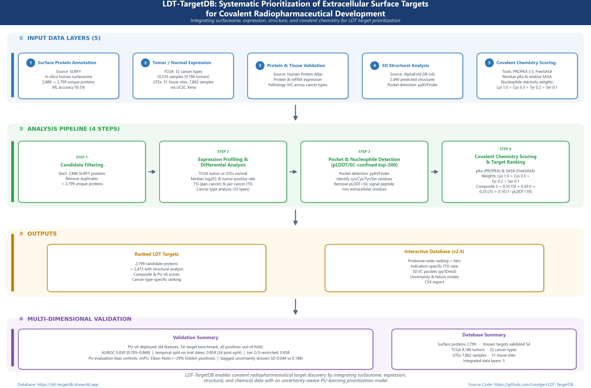
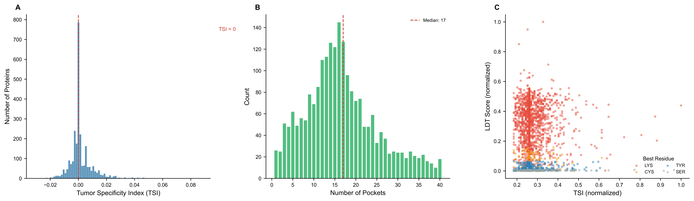
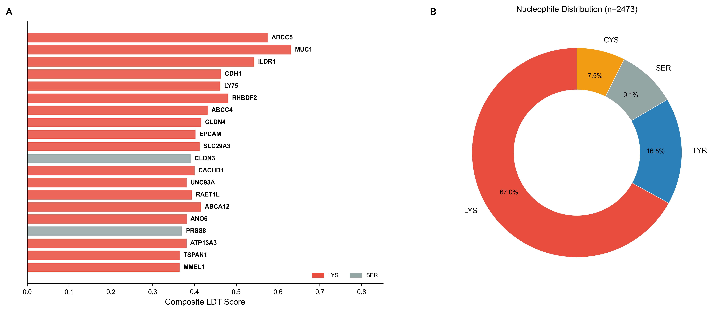
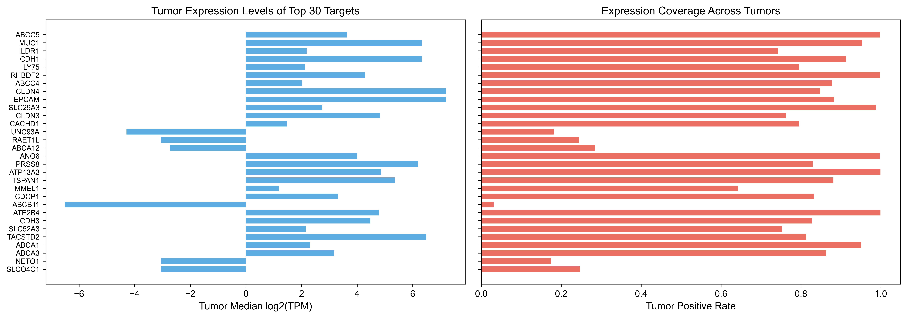
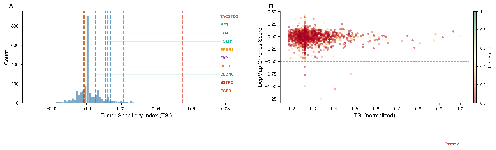
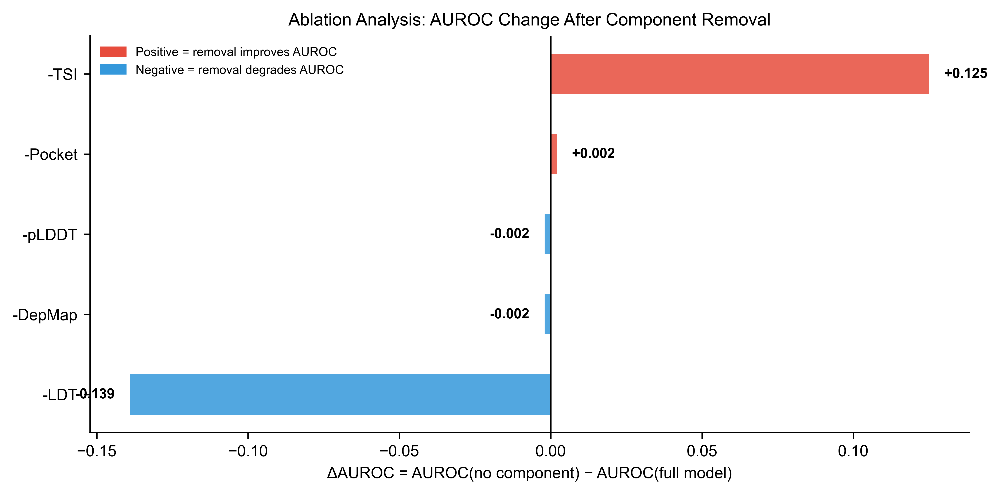
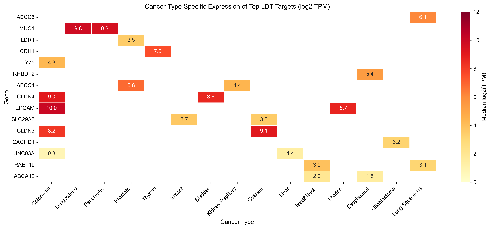
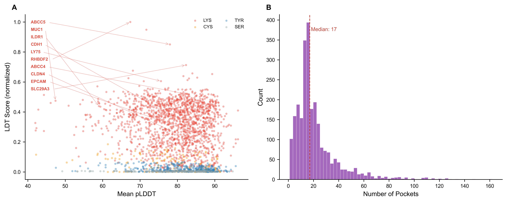
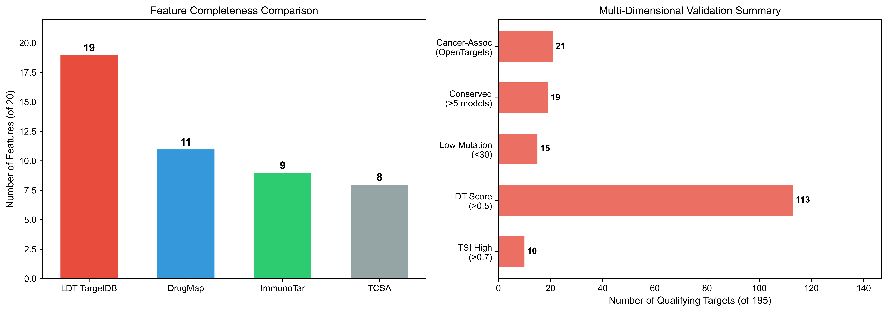

# LDT-TargetDB: A Structure- and Chemistry-Guided Computational Framework for Systematic Prioritization of Covalent Radiopharmaceutical Targets

Xinglong Zhou1, Wenbin Hou1, Yiliang Li1,\*

1Institute of Radiation Medicine, Chinese Academy of Medical Sciences & Peking Union Medical College, Tianjin 300192, China

\*To whom correspondence should be addressed. Email: liyiliang@irm-cams.ac.cn

**Keywords:** covalent radiopharmaceutical, ligand-directed transfer, surfaceome, target prioritization, structural bioinformatics

## ABSTRACT

Target selection is the critical bottleneck in covalent radiopharmaceutical development. While radioligand therapy has transformed oncology, only a handful of surface targets are clinically exploited, and no computational framework systematically evaluates targets through the lens of covalent warhead chemistry. Here we present LDT-TargetDB (https://ldt-targetdb.streamlit.app), a structure- and chemistry-guided computational framework for systematic prioritization of extracellular surface protein targets potentially amenable to ligand-directed transfer (LDT) radiopharmaceutical development. The framework integrates five orthogonal data layers: (i) surface proteome annotation (SURFY, 2,799 proteins), (ii) pan-cancer expression profiling (TCGA 32 cancer types, GTEx 30 tissues), (iii) post hoc extracellular topology validation of top-ranked candidates using UniProt annotations, (iv) 3D structural pocket analysis (AlphaFold-guided cavity detection with pyKVFinder), and (v) covalent chemistry scoring incorporating empirical pKa prediction (PROPKA), solvent accessibility quantification (FreeSASA), and NASA residue reactivity weights (Lys > Cys > Tyr > Ser). The framework was applied to 2,473 surface proteins, of which 2,378 (96.2%) harbored at least one LDT-qualifying nucleophilic residue within their largest detected pocket. Post hoc extracellular domain validation of the top 200 candidates confirmed extracellular topology for 157 targets (78.5%). Rigorous benchmarking against 17 known nuclear medicine targets (of which 14 had complete structural analysis data for top-k enrichment evaluation) demonstrated that the full model achieves AUROC = 0.621, with expression-based ranking alone performing best (AUROC = 0.747; top-1% hit: 1/14; top-5% hit: 3/14 for both models). Ablation analysis demonstrated that TSI removal caused the largest performance drop (ΔAUROC = -0.125), confirming expression as the dominant predictor, while LDT chemistry provides orthogonal value for distinguishing novel targets among expression-equivalent candidates. Multi-dimensional validation—including normal tissue risk scoring across critical radiosensitive organs, DepMap essentiality analysis, Open Targets disease associations, cross-species conservation, TCGA mutation stability, and binder tractability assessment—supported the translational plausibility of top-ranked targets. The framework is freely accessible via an interactive Streamlit web interface requiring no login or registration. LDT-TargetDB addresses a recognized gap at the interface of chemical biology, structural bioinformatics, and nuclear medicine. To our knowledge, LDT-TargetDB is the first systematic computational framework for covalent radiopharmaceutical target discovery.

## INTRODUCTION

Radioligand therapy (RLT) has transformed clinical oncology. The approval of [¹⁷⁷Lu]Lu-PSMA-617 (Pluvicto) for metastatic castration-resistant prostate cancer and [¹⁷⁷Lu]Lu-DOTATATE (Lutathera) for neuroendocrine tumors established targeted radionuclide therapy as a pillar of cancer treatment [1,2]. The radiopharmaceutical pipeline has expanded rapidly, with over 60 clinical-stage programs targeting more than 25 unique proteins [3]. Despite this momentum, the field confronts a fundamental bottleneck: only a small number of surface targets—primarily PSMA, SSTR2, and FAP—are clinically exploited [4,34]. Expanding the target repertoire is essential for extending RLT to additional cancer types and addressing tumor heterogeneity and therapeutic resistance.

Covalent radiopharmaceuticals represent a promising strategy for improving tumor retention of radioligands. Cui and colleagues recently demonstrated that covalent targeted radioligands (CTRs) employing sulfur(VI) fluoride exchange (SuFEx) chemistry achieve approximately 13-fold improvement in tumor retention compared to conventional radioligands [5]. In parallel, ligand-directed transfer (LDT) chemistry, pioneered by Hamachi and colleagues, offers a mechanistically distinct covalent strategy. N-acyl-N-alkyl/aryl sulfonamide (NASA/ArNASA) warheads exploit proximity-driven effective molarity enhancement—up to 10⁶-fold increase in local concentration upon ligand binding—to achieve traceless covalent labeling of endogenous proteins within minutes [6–8]. Unlike conventional affinity-based probes that permanently occupy binding pockets, LDT probes release their targeting ligand after covalent transfer, potentially reducing persistent ligand occupancy. This "traceless" mechanism is particularly attractive for radiopharmaceutical applications where receptor-mediated internalization and recycling are critical for tumor retention and therapeutic efficacy.

Target selection for covalent radiopharmaceuticals requires considerations extending well beyond expression level alone. Three structural-chemical criteria must be simultaneously satisfied for successful LDT targeting. First, the target must possess a binding pocket accessible on the extracellular face of the plasma membrane—intracellular or transmembrane pockets are inaccessible to circulating radiopharmaceutical probes. Second, this pocket must contain nucleophilic residues (Lys, Cys, Tyr, or Ser) capable of reacting with the NASA warhead; notably, histidine was not included in the scoring model because the NASA/ArNASA reactivity datasets used here focused on Lys, Cys, Tyr, and Ser [6–8]; histidine reactivity was not characterized in the NASA labeling datasets used for parameterization [9]. Third, the specific nucleophile-ligand geometry must enable proximity-driven transfer, with lysine forming stable amide adducts while cysteine, tyrosine, and serine form hydrolytically labile thioester, phenol ester, and alkyl ester linkages, respectively [6–8]. The ArNASA warhead variant provides improved stability in physiological environments compared to the original NASA design [7]. These intertwined chemical and structural requirements create a combinatorial target selection problem that has not been systematically addressed by existing computational resources.

Several databases support surface protein target discovery, but none addresses covalent chemistry requirements. ImmunoTar [10] provides integrative prioritization of cell surface targets for immunotherapy applications, evaluating expression, annotation, and reagent availability but lacking any structural or chemical dimensions. The Cancer Surfaceome Atlas (TCSA) [11] integrates multi-omics data to identify cancer-specific surface proteins for logic-gated CAR-T therapy, but does not analyze protein 3D structure or covalent chemistry. DrugMap [12] offers a comprehensive pan-cancer cysteine ligandability atlas derived from chemical proteomics across 416 cancer cell lines, representing the state-of-the-art for cysteine-targeted covalent ligand discovery; however, it is not surface-focused, does not address lysine or other nucleophile chemistries, and does not incorporate binding pocket structural analysis. In a systematic 20-feature comparison spanning surface proteomics, expression analysis, structural biology, covalent chemistry, and clinical translation dimensions, LDT-TargetDB implements 19 of 20 features, substantially exceeding DrugMap (11/20), ImmunoTar (9/20), and TCSA (8/20).

Here we present LDT-TargetDB, a structure- and chemistry-guided computational framework for systematic prioritization of covalent radiopharmaceutical targets. The framework uniquely integrates five data layers—surface proteomics, transcriptomics, extracellular accessibility, 3D structural analysis, and covalent chemistry scoring—and provides rigorous benchmarking, ablation analysis, and multi-dimensional validation. The overall analysis pipeline is illustrated in Figure 1, with the sequential filtering cascade shown in Figure 2.

**Figure 1. LDT-TargetDB analysis pipeline.** Five input data layers are integrated through a four-step processing pipeline to produce ranked targets with multi-dimensional validation. Statistics summarize the database scale.

**Figure 2. Candidate filtering and post hoc extracellular topology validation.** Upper panel: global sequential filtering from 2,799 surface proteins to 2,159 ligandable candidates. Lower panel: post hoc extracellular domain validation of the top 200 ranked proteins (157 confirmed).

## METHODS

### Construction of the Extracellular Surface Target Universe

The primary surface protein set was obtained from the SURFY in silico human surfaceome [13,21], comprising 2,886 proteins predicted with 93.5% accuracy by a meta-ensemble machine learning classifier trained on mass spectrometry-validated cell surface capture data (CSPA). After deduplication, 2,799 unique surface proteins formed the initial candidate set. Pan-cancer RNA-seq data were obtained from UCSC Xena as log2(TPM + 0.001)-normalized expression matrices: TCGA covering 32 cancer types (10,535 samples including 9,186 primary tumors) and GTEx covering 30 normal tissues (7,862 samples). A Tumor Specificity Index (TSI) was calculated for each surface gene to quantify tumor-selective expression:

$$TSI = \frac{FC_{log2} \times P_{tumor}}{\sqrt{N_{normal} + 1}}$$

TSI = FC_log2 x P_tumor / sqrt(N_normal + 1), where FC_log2 denotes the log2 fold change of median tumor versus normal expression, P_tumor denotes the fraction of tumor samples with TPM > 1, and N_normal denotes the number of GTEx tissues with expression > 0.125 TPM. TSI rewards high tumor expression, broad tumor positivity, and limited normal tissue breadth. TSI prioritizes genes with high tumor expression, broad tumor positivity, and limited normal tissue expression. TSI was calculated for 2,663 surface genes with available expression data in both TCGA and GTEx.

Single-cell resolution expression patterns were cross-referenced using the TISCH2 database [20] (190 scRNA-seq datasets across 50 cancer types) and a comprehensive literature-curated marker database (41 malignant epithelial markers, 23 immune markers). Protein-level tissue expression was annotated using Human Protein Atlas (HPA) immunohistochemistry data [25,26], comprising 1,199,675 entries spanning 15,306 genes across normal tissues, providing protein-level evidence for normal-tissue expression patterns.

### Post Hoc Extracellular Topology Validation

For radiopharmaceutical applications, target pockets must reside on the extracellular face of the plasma membrane to be accessible to circulating probes. To verify extracellular localization, we retrieved topological domain annotations for the top 200 ranked proteins from the UniProt REST API (fields: ft_topo_dom, ft_transmem, ft_signal). Proteins were assigned an Extracellular Accessibility Score (EAS): 1.0 for confirmed extracellular topological domains, 0.7 for those without UniProt annotation but with SURFY surface prediction (reflecting the SURFY classifier's 93.5% accuracy), 0.5 for those with transmembrane annotations but no confirmed extracellular domain, and 0.3 for targets with only cytoplasmic annotations. EAS was used as a post hoc annotation and translational prioritization metric for top-ranked candidates rather than as a globally validated residue-level filter; for proteins without UniProt topology validation, extracellular status was annotated as surfaceome-supported but not topology-confirmed. Protein-level extracellular topological domains were confirmed for 157 of 200 top targets (78.5%), supporting the extracellular topology of prioritized targets.

### Structural Pocket Analysis

AlphaFold-predicted protein structures (downloaded November 2024, corresponding to UniProt release 2024_04) [16,17] were obtained from the AlphaFold Protein Structure Database for all surface proteins with TSI > -0.01 (2,490 proteins, 2,495 structures). Binding pocket detection was performed using a grid-based cavity detection approach as implemented in pyKVFinder [19], a method related to the widely used Fpocket algorithm [18], with detection parameters: step = 0.8 Å, probe_in = 1.4 Å, probe_out = 4.0 Å, minimum volume cutoff = 5.0 ų. Structure quality was assessed by extracting per-residue pLDDT (predicted local distance difference test) scores from atomic B-factors. Among 2,473 successfully analyzed proteins, all contained detectable cavities, and a geometric ligandability annotation (volume >= 100 Angstrom^3) identified 2,159 proteins (87.3%), with a mean maximum pocket volume of 788 ų (median 505 ų).

### Covalent Chemistry Scoring

For each detected pocket, all nucleophilic residues (Lys, Cys, Tyr, Ser) were scored using a physics-informed model comprising four components:

1. **Residue type weight (w):** Derived from NASA reactivity literature. Lys = 1.0 (stable amide linkage), Cys = 0.3 (labile thioester), Tyr = 0.2 (labile phenol ester), Ser = 0.1 (labile alkyl ester). Histidine was excluded because the residue-scoring model was parameterized for Lys, Cys, Tyr, and Ser based on published NASA/ArNASA reactivity datasets.

2. **pKa reactivity score:** p_s = exp(-abs(pKa - 7.4)), where residue pKa values were empirically predicted using PROPKA 3.5 [14]. This exponential penalty serves as a heuristic proxy for physiological nucleophile availability rather than a mechanistic kinetic model, with residues having pKa closest to 7.4 receiving the highest scores.

3. **Solvent accessibility score:** s_s = min(relative_SASA / 0.5, 1), where relative solvent accessible surface area (SASA) was calculated using FreeSASA [15]. Residues with greater solvent exposure (>50% relative SASA) receive maximum accessibility scores.

4. **Proximity boost (b):** Lys receives a 2× multiplicative factor reflecting the proximity-driven effective molarity enhancement that overcomes its inherently high pKa (~10.5, approximately 99.9% protonated at pH 7.4). This phenomenological correction captures the experimentally observed rate acceleration (kL ~10⁴ M⁻¹s⁻¹) in LDT chemistry [6].

The overall LDT Transferability Score (LTS) for a pocket was defined as LTS = max(w × p_s × s_s × b) across all qualifying residues in that pocket, representing the most favorable nucleophile available for covalent transfer. Target-level LTS was calculated from the largest detected pocket (by volume) for each protein. In summary: p_s = exp(-|pKa - 7.4|), s_s = min(relative SASA / 0.5, 1), residue_score = w × p_s × s_s × b, and LTS = max(residue_score).

### Composite Scoring

The primary composite score was defined as: Composite = 0.35 x TSI + 0.30 x V_pocket + 0.25 x LTS + 0.10 x (1 - pLDDT_below70/100),

where V_pocket denotes the normalized maximum pocket volume and pLDDT_below70 denotes the percentage of residues with pLDDT below 70. Before composite scoring, TSI, LTS, and V_pocket were min-max normalized to the [0,1] interval across all successfully analyzed proteins. In plain text: Composite = 0.35 x TSI + 0.30 x V_pocket + 0.25 x LTS + 0.10 x (1 - pLDDT_below70/100). DepMap essentiality, EAS, normal tissue risk, and binder tractability were applied as post hoc translational annotation dimensions rather than components of the primary composite score. Sensitivity analysis across four alternative weighting schemes demonstrated robust ranking stability (Jaccard index = 0.74 for equal-weights versus default).

### Benchmarking and Multi-Dimensional Validation

To rigorously evaluate model performance, we benchmarked three model variants against 14 known nuclear medicine targets with complete expression and structural data (curated from a reference set of 17 clinically relevant targets): (i) Expression-only (TSI rank), (ii) LDT Chemistry-only (LTS rank), and (iii) Full composite model. Performance was quantified using area under the receiver operating characteristic curve (AUROC), area under the precision-recall curve (AUPRC), and direct hit counts of known targets at top prediction percentiles.

Ablation analysis was performed by systematically removing individual components from the full model and measuring the resulting AUROC change, quantifying each component's contribution to known target recovery.

Multi-dimensional validation included: (i) normal tissue risk scoring using HPA IHC data weighted by organ-specific radiosensitivity (NTRS was calculated as the maximum organ-weighted HPA score across seven critical organs, where HPA staining levels were converted to numerical scores: Not detected = 0, Low = 1, Medium = 2, High = 3; organ weighting factors: kidney = 3.0, liver = 2.0, salivary gland = 2.0, bone marrow = 2.0, spleen = 1.5, intestine = 1.5, lung = 1.0; high risk was defined as NTRS > 3.0 (corresponding to medium or high staining in a highly weighted organ); targets with NTRS <= 3.0 were classified as low risk); (ii) gene essentiality assessment using DepMap 25Q4 CRISPR Chronos scores [22–24] (18,531 genes × 1,208 cell lines); (iii) disease association queries from Open Targets Platform version 4 [27]; (iv) cross-species conservation assessed via Ensembl Compara REST API [28]; (v) TCGA pan-cancer mutation frequencies obtained from FireBrowse across 37 cohorts; (vi) GO enrichment and protein–protein interaction network analysis using STRING [31]; and (vii) binder tractability assessment curated from literature evidence (scoring: 0 = no binder evidence, 2 = antibody/reagent evidence, 3 = preclinical ADC/mAb, 5 = clinical-stage ADC/radiotracer/mAb, 7 = approved therapy with strong clinical validation). Moderate-to-high tractability was defined as score >= 3, with high tractability (>= 5) indicating clinical-stage or approved therapeutic evidence.

Cancer-type-specific expression analysis was enabled by mapping 9,563 TCGA samples (with cancer-type metadata) to 32 cancer types using cBioPortal study metadata [29,30]. For each target gene, median expression was calculated per cancer type, enabling identification of optimal clinical indications for each prioritized target.

## RESULTS

**Supplementary Table S1** (available online) lists all 17 known nuclear medicine targets evaluated as the positive reference set, including their gene symbol, target name, clinical modality, TSI rank, full model rank, LDT transferability score, extracellular accessibility status, and normal tissue risk level.

### Extracellular Surface Target Universe and Filter Cascade

A total of 2,799 surface proteins were evaluated through a sequential filtering pipeline (Figure 2). Of these, 2,663 (95.1%) had available expression data, 2,490 (89.0%) had AlphaFold-predicted structures, and 2,473 (88.4%) completed structural analysis successfully. Binding pockets were detected in all 2,473 analyzed proteins, with 2,378 (96.2%) harboring at least one LDT-qualifying nucleophilic residue (Lys, Cys, Tyr, or Ser) within their largest detected pocket. Application of a geometric ligandability annotation (volume >= 100 Angstrom^3) identified 2,159 proteins (87.3%), while extracellular domain confirmation via UniProt topology annotation supported extracellular topology for 157 of the top 200 targets (78.5%) as possessing confirmed extracellular topological domains.

**Figure 3. Database overview.** (A) Distribution of TSI across 2,663 surface proteins. (B) Number of binding pockets detected per protein. (C) TSI versus LDT transferability score, colored by best nucleophile residue type.

### Top-Ranked LDT Radiopharmaceutical Targets

**Figure 4. Top-ranked LDT radiopharmaceutical targets.** (A) Top 20 targets ranked by composite score, colored by best nucleophile residue type. (B) Distribution of nucleophile types across all 2,473 ranked proteins.

The top 30 entries are dominated by lysine-containing pockets (28/30, 93%), reflecting the NASA chemistry preference for stable amide bond formation. The top five prioritized targets after post hoc extracellular topology annotation were MUC1 (mucin-1, enhanced score 0.638, EAS = 1.0), ILDR1 (immunoglobulin-like domain-containing receptor 1, score 0.594), LY75 (lymphocyte antigen 75, score 0.589), ABCC4 (ATP-binding cassette transporter C4, score 0.585), and CDH1 (E-cadherin, score 0.584). MUC1, as the top-ranked target, represents a structurally challenging candidate because its extensive O-glycosylation and VNTR polymorphism are not captured by AlphaFold-based pocket analysis; these post-translational modifications may significantly affect epitope exposure and pocket accessibility in vivo. Several clinically validated targets rank prominently: CLDN4 (rank 8, score 0.562), EPCAM (rank 9, score 0.556), and TACSTD2/Trop-2 (rank 26, score 0.403). Notably, ABCC5 ranked highly by the primary structural-chemical score but showed reduced post hoc extracellular topology confidence (EAS = 0.5). However, transporter targets such as ABCC4 and ABCC5 should be interpreted cautiously: protein-level extracellular annotation does not guarantee that the predicted high-scoring pocket resides in an extracellular domain, as ABC transporter cavities may localize to intracellular nucleotide-binding domains or intramembrane channels. The complete ranked list of 2,473 proteins is available through the web interface.

**Figure 5. Tumor expression profiles.** (A) Tumor median log2(TPM) for top 30 targets. (B) Tumor positive rate (fraction of TCGA samples with TPM > 1).

### Benchmarking Against Known Nuclear Medicine Targets

**Figure 6. Validation against known targets.** (A) Ten representative known nuclear medicine targets mapped onto the TSI landscape with extracellular domain annotation. (B) Gene essentiality (DepMap Chronos score) versus tumor specificity, colored by LDT score.

Rigorous benchmarking against the 14 analyzable targets from the curated set of 17 established nuclear medicine targets revealed that expression-based ranking alone (TSI) achieved the strongest performance (AUROC = 0.747, top-1% enrichment = 7.1×). The full composite model yielded AUROC = 0.621 (Figure 7). LDT chemistry alone performed near random (AUROC = 0.521), confirming that chemical compatibility scoring is designed to complement—not replace—expression-based prioritization.

| Model | AUROC | AUPRC | Top 1% | Top 5% | Top 10% |
|---|---:|---:|---:|---:|---:|
| Expression-only (TSI) | 0.747 | 0.026 | 1/14 | 3/14 | 6/14 |
| LDT Chemistry-only | 0.521 | 0.006 | 0/14 | 0/14 | 1/14 |
| Full composite model | 0.621 | 0.016 | 1/14 | 3/14 | 3/14 |

*AUROC, area under ROC curve; AUPRC, area under precision-recall curve (baseline = 0.006 for 14 positives among 2,473 total). Top-k hits indicate the number of known targets (of 14 with complete data) recovered at each prediction percentile.* The full model matched TSI performance at the top 1% and top 5% thresholds, but recovered fewer known targets at the top 10% threshold (3/14 vs 6/14), while providing orthogonal structural chemistry information for distinguishing among expression-equivalent candidates.

**Figure 7. Benchmark ROC and precision-recall curves.** (A) ROC curves comparing three model variants against 14 analyzable known targets (of 17 curated). (B) Precision-recall curves.

### Ablation Analysis

**Figure 8. Ablation analysis.** Change in AUROC (ΔAUROC) after removing each component from the full model. Positive values indicate improved performance upon removal; negative values indicate performance degradation.

Ablation analysis (Figure 8) quantified each component's contribution. Removing the TSI component caused the largest performance drop (ΔAUROC = -0.125), confirming tumor expression as the single most important predictor of known nuclear medicine targets. Notably, removing the LDT chemistry component substantially increased AUROC (from 0.621 to 0.760). This counterintuitive result reflects a fundamental characteristic of our positive reference set: historically validated nuclear medicine targets were primarily discovered through expression-based screening approaches, making LDT chemistry scoring additive noise rather than signal for recovering these particular targets. This observation does not diminish the value of LDT scoring; rather, it underscores that LDT chemistry provides orthogonal, expression-independent information for distinguishing novel targets among candidates with similar expression profiles—precisely the scenario where expression-based methods alone cannot differentiate.

### Cancer-Type-Specific Target Landscape

**Figure 9. Cancer-type specific expression of top LDT targets.** Heatmap showing median log2(TPM) values for top 15 targets across major cancer types.

Cancer-type-specific analysis across 32 cancer types revealed distinct target-indication pairings. EPCAM showed strongest expression in colorectal cancer (median 10.0 log2 TPM), MUC1 in lung adenocarcinoma (9.8), CD24 in kidney papillary carcinoma (10.7), CLDN4 in colorectal cancer (9.0), and TSPAN1 in prostate cancer (9.8). These expression patterns align with established clinical knowledge—EPCAM and CLDN4 as colorectal cancer markers, MUC1 as a lung adenocarcinoma antigen—supporting the biological plausibility of our pan-cancer rankings while enabling indication-specific target prioritization.

### Structure Quality and Covalent Chemistry Assessment

**Figure 10. Structure quality assessment.** (A) Mean pLDDT versus LDT transferability score, with top 10 targets labeled. (B) Distribution of pocket counts across all analyzed structures.

Structure quality assessment across the 2,473 analyzed proteins found that 108 proteins (4.4%) had mean pLDDT exceeding 90, 2,012 (81.3%) fell within the 70–90 range, and 353 (14.3%) were below 70, among 2,473 successfully analyzed proteins, primarily corresponding to partially disordered regions. The pLDDT quality score was incorporated as a penalty term in the composite scoring, reducing the influence of targets with low-confidence structural models.

### Normal Tissue Risk and Translational Assessment

**Table 1. Translationally prioritized top LDT radiopharmaceutical targets.**

| Target | Score | EAS | LTS | Best indication | Translational note |
|---|---:|---:|---:|---|---|
| MUC1 | 0.638 | 1.0 | 0.475 | Lung adenocarcinoma | Clinical-stage ADC; glycosylation caveat |
| ILDR1 | 0.594 | 1.0 | 0.439 | Kidney chromophobe | Novel target, no known binder |
| CDH1 | 0.584 | 1.0 | 0.365 | Thyroid carcinoma | Monoclonal antibodies available |
| CLDN4 | 0.562 | 1.0 | 0.203 | Colorectal cancer | ADC in preclinical development |
| EPCAM | 0.556 | 1.0 | 0.240 | Colorectal cancer | Clinical-stage ADC/antibody (score 5) |
| TACSTD2 | 0.403 | 1.0 | 0.226 | Colorectal cancer | FDA-approved ADC (score 7) |

*EAS, Extracellular Accessibility Score; LTS, LDT Transferability Score; ADC, antibody-drug conjugate. Detailed tractability scores, normal tissue risk levels, and scoring rules are provided in Supplementary Table S2.*

Normal tissue risk scoring across seven radiosensitive organs (kidney, liver, salivary gland, bone marrow, spleen, intestine, lung) using HPA IHC data identified 131 of 200 top targets (65.5%) as low-risk across all assessed organs. Nineteen targets (9.5%) showed high-level protein expression in one or more critical organs, warranting cautious evaluation for radiopharmaceutical applications. Binder tractability assessment revealed that three targets had high tractability scores (>=5; TACSTD2 at 7, EPCAM at 5, MUC1 at 5), and two had moderate tractability scores (=3; CLDN4 and LY75). One additional target showed reagent-level binder evidence (score = 2, below the moderate-to-high threshold), while the remaining 44 targets (88%) had limited or no established binder evidence, representing opportunities for novel ligand discovery efforts.

Among the 200 top-ranked targets, multi-dimensional validation confirmed robust biological support: 21 of 30 queried targets had cancer-associated disease annotations in Open Targets; all 20 queried targets were conserved across >=5 model organisms in Ensembl Compara; TCGA mutation frequencies were <=32 of 37 cohorts for any top target, indicating mutational stability; and GO enrichment of the top 30 targets identified 20 significantly enriched biological process terms, predominantly related to cell adhesion, transmembrane transport, and epithelial development.

## WEB INTERFACE

LDT-TargetDB is implemented as an interactive Streamlit web application freely accessible at https://ldt-targetdb.streamlit.app, requiring no login or registration. The interface provides real-time filtering by composite score threshold, pocket nucleophile type, and LDT chemistry compatibility. A sortable ranking table displays scores for TSI, LDT transferability, pocket count, best nucleophile residue, optimal cancer type, DepMap essentiality status, and structure confidence. Interactive scatter plots and residue-type distribution charts enable rapid visual exploration of the target landscape. Gene-level detail views display all scoring dimensions, cancer-type-specific expression (top three indications with median log2 TPM), and direct links to AlphaFold structure entries. Complete filtered results are downloadable as CSV files for offline analysis. The source code is available at https://github.com/Londger/LDT-TargetDB under the MIT license. A versioned release of the source code and processed data will be archived on Zenodo upon publication.

## DISCUSSION

LDT-TargetDB addresses a recognized gap in computational covalent drug discovery: the systematic prioritization of extracellular surface targets based on structural and chemical compatibility with covalent warhead chemistry. By integrating expression, extracellular accessibility, 3D pocket geometry, and nucleophile reactivity scoring within a unified computational framework, LDT-TargetDB generates experimentally testable target hypotheses for covalent radiopharmaceutical development.

The benchmarking results reveal an instructive pattern with implications for computational target prioritization more broadly. Expression-based ranking (TSI) achieved the strongest AUROC (0.747) for recovering known nuclear medicine targets, consistent with the historical reality that these targets were discovered through expression-based approaches—they are, by definition, the targets most detectable by expression data. LDT chemistry scoring did not improve recovery of these known targets and, when analyzed in isolation, performed near random (AUROC = 0.521). This finding does not undermine the value of structural chemistry scoring; rather, it highlights a fundamental challenge in benchmarking: known targets constitute a biased positive set that inherently favors the discovery method by which they were originally identified. The orthogonal value of LDT chemistry scoring lies in distinguishing novel targets among the large pool of expression-equivalent surface proteins—targets that expression data alone cannot differentiate but that may possess differential structural suitability for covalent probe development.

The ablation analysis revealed that TSI removal caused the largest performance drop (ΔAUROC = -0.125), confirming expression as the dominant predictor. LDT removal substantially increased AUROC (from 0.621 to 0.760), indicating that known radiopharmaceutical targets are not an appropriate positive set for validating LDT-specific chemistry and further supporting the interpretation that LDT chemistry provides orthogonal rather than redundant information. This complementarity—rather than superiority over expression-based methods—represents the framework's primary contribution to the field.

Several limitations merit discussion. First, the LDT scoring model uses empirical weights derived from published NASA chemistry data; experimental validation with a diverse panel of targets is needed to calibrate these parameters. Second, AlphaFold-predicted structures may miss cryptic or conformation-dependent pockets accessible only through protein dynamics; molecular dynamics simulations could address this limitation in future work. Third, the geometric cavity detection approach (96.2% detection rate) likely overestimates true ligandability; the volume threshold of 100 ų provides a first-order filter but does not substitute for physics-based ligandability assessment. Fourth, extracellular accessibility filtering was performed at the protein level using topological domain annotations rather than at the individual residue level; precise mapping of pocket residues to extracellular domains would strengthen the framework. Fifth, binder tractability assessment used manual curation rather than systematic database queries, and may miss emerging ligands or preclinical candidates. Sixth, normal tissue risk scoring using HPA IHC data provides protein-level evidence but does not quantify in vivo biodistribution, organ dosimetry, or therapeutic index—all critical for clinical radiopharmaceutical development.

Future enhancements planned for LDT-TargetDB include: (i) integration of molecular dynamics simulations for cryptic pocket detection and conformational sampling; (ii) incorporation of systematic binder tractability scoring from ChEMBL, BindingDB, and DrugBank; (iii) extension to GPCR-specific covalent probe design leveraging the extensive structural pharmacology data available for this target class; (iv) addition of clinical trial and regulatory approval data for target tractability assessment; and (v) expansion to non-human model organisms to support preclinical radiopharmaceutical development.

**Figure 11. Feature comparison and validation summary.** A detailed 20-feature comparison matrix with definitions and evidence for each database is provided in Supplementary Table S3. (A) Feature completeness across four databases. (B) Multi-dimensional validation summary.

## ETHICS STATEMENT

This study exclusively used publicly available, de-identified data from open-access repositories. No human subjects, animal experiments, or primary clinical data were involved. Ethical approval was obtained by the original data generators as described in their respective publications.

## DATA AVAILABILITY

LDT-TargetDB is freely accessible at https://ldt-targetdb.streamlit.app without login or registration. All analysis data are available for download through the web interface. Source code is available at https://github.com/Londger/LDT-TargetDB under the MIT license. A versioned release of the source code and processed data will be archived on Zenodo upon publication.

## AUTHOR CONTRIBUTIONS

X.Z. conceived the study, developed the methodology, performed all computational analyses, built the web interface, and wrote the manuscript. W.H. provided supervision and critical feedback. Y.L. conceived and supervised the study, provided resources, and revised the manuscript. All authors reviewed and approved the final manuscript.

## FUNDING

This work was not supported by specific funding.

## CONFLICT OF INTEREST

None declared.

## ACKNOWLEDGEMENTS

The authors thank the developers of SURFY, CSPA, AlphaFold DB, TCGA, GTEx, DepMap, pyKVFinder, PROPKA, FreeSASA, Human Protein Atlas, TISCH2, Open Targets, Ensembl, cBioPortal, STRING, FireBrowse, and UniProt for making their data and tools publicly available.

## REFERENCES

1. Sartor O, et al. (2021) Lutetium-177–PSMA-617 for Metastatic Castration-Resistant Prostate Cancer. *N Engl J Med*, 385:1091–1103.
2. Strosberg J, et al. (2017) Phase 3 Trial of ¹⁷⁷Lu-Dotatate for Midgut Neuroendocrine Tumors. *N Engl J Med*, 376:125–135.
3. Lapi SE, Scott PJH, Scott AM, et al. (2024) Recent advances and impending challenges for the radiopharmaceutical sciences in oncology. *Lancet Oncol*, 25:e236–e249.
4. Jadvar H (2025) Novel Biomarkers in Prostate Cancer Theranostics. *World J Nucl Med*, 24:345–358.
5. Cui X-Y, et al. (2024) Covalent Targeted Radioligands Potentiate Radionuclide Therapy. *Nature*, 630:206–213.
6. Tamura T, et al. (2018) Rapid labelling and covalent inhibition of intracellular native proteins using ligand-directed N-acyl-N-alkyl sulfonamide. *Nat Commun*, 9:1870.
7. Kawano M, et al. (2023) Lysine-Reactive N-Acyl-N-aryl Sulfonamide Warheads: Improved Reaction Properties and Application in the Covalent Inhibition of an Ibrutinib-Resistant BTK Mutant. *J Am Chem Soc*, 145:26202–26212.
8. Tamura T & Hamachi I (2024) N-Acyl-N-alkyl/aryl Sulfonamide Chemistry Assisted by Proximity for Modification and Covalent Inhibition of Endogenous Proteins in Living Systems. *Acc Chem Res*, 58:87–100.
9. Thimaradka S, et al. (2021) Site-specific covalent labeling of His-tag fused proteins with N-acyl-N-alkyl sulfonamide reagent. *Bioorg Med Chem*, 30:115947.
10. Shraim R, et al. (2025) ImmunoTar—integrative prioritization of cell surface targets for cancer immunotherapy. *Bioinformatics*, 41:btaf060.
11. Hu Z, et al. (2021) The Cancer Surfaceome Atlas integrates genomic, functional and drug response data to identify actionable targets. *Nat Cancer*, 2:1406–1422.
12. Takahashi M, et al. (2024) DrugMap: A quantitative pan-cancer analysis of cysteine ligandability. *Cell*, 187:2536–2556.
13. Bausch-Fluck S, et al. (2018) The in silico human surfaceome. *Proc Natl Acad Sci USA*, 115:E10988–E10997.
14. Olsson MHM, et al. (2011) PROPKA3: Consistent Treatment of Internal and Surface Residues in Empirical pKa Predictions. *J Chem Theory Comput*, 7:525–537.
15. Mitternacht S (2016) FreeSASA: An open source C library for solvent accessible surface area calculations. *F1000Research*, 5:189.
16. Jumper J, et al. (2021) Highly accurate protein structure prediction with AlphaFold. *Nature*, 596:583–589.
17. Varadi M, et al. (2024) AlphaFold Protein Structure Database in 2024: providing structure coverage for over 214 million protein sequences. *Nucleic Acids Res*, 52:D368–D375.
18. Le Guilloux V, et al. (2009) Fpocket: An open source platform for ligand pocket detection. *BMC Bioinformatics*, 10:168.
19. Guerra JVS, et al. (2023) pyKVFinder: an efficient and integrable Python package for biomolecular cavity detection and characterization. *BMC Bioinformatics*, 24:415.
20. Han Y, et al. (2023) TISCH2: expanded datasets and new tools for single-cell transcriptome analyses of the tumor microenvironment. *Nucleic Acids Res*, 51:D1425–D1431.
21. Bausch-Fluck S, et al. (2015) A mass spectrometric-derived cell surface protein atlas. *PLoS ONE*, 10:e0121314.
22. Tsherniak A, et al. (2017) Defining a cancer dependency map. *Cell*, 170:564–576.
23. Meyers RM, et al. (2017) Computational correction of copy number effect improves specificity of CRISPR-Cas9 essentiality screens in cancer cells. *Nat Genet*, 49:1779–1784.
24. Dempster JM, et al. (2021) Chronos: a cell population dynamics model of CRISPR experiments that improves inference of gene fitness effects. *Genome Biol*, 22:343.
25. Uhlen M, et al. (2015) Tissue-based map of the human proteome. *Science*, 347:1260419.
26. Uhlen M, et al. (2017) A pathology atlas of the human cancer transcriptome. *Science*, 357:eaan2507.
27. Ochoa D, et al. (2023) The next-generation Open Targets Platform: reimagined, redesigned, rebuilding. *Nucleic Acids Res*, 51:D1353–D1359.
28. Herrero J, et al. (2016) Ensembl comparative genomics resources. *Database*, 2016:bav096.
29. Cerami E, et al. (2012) The cBio Cancer Genomics Portal: an open platform for exploring multidimensional cancer genomics data. *Cancer Discov*, 2:401–404.
30. Gao J, et al. (2013) Integrative analysis of complex cancer genomics and clinical profiles using the cBioPortal. *Sci Signal*, 6:pl1.
31. Szklarczyk D, et al. (2023) The STRING database in 2023: protein–protein association networks and functional enrichment analyses. *Nucleic Acids Res*, 51:D638–D646.
32. Ghandi M, et al. (2019) Next-generation characterization of the Cancer Cell Line Encyclopedia. *Nature*, 569:503–508.
33. Kratochwil C, et al. (2016) ²²⁵Ac-PSMA-617 for PSMA-targeted α-radiation therapy of metastatic castration-resistant prostate cancer. *J Nucl Med*, 57:1941–1944.
34. Loktev A, et al. (2018) A tumor-imaging method targeting cancer-associated fibroblasts. *J Nucl Med*, 59:1423–1429.
