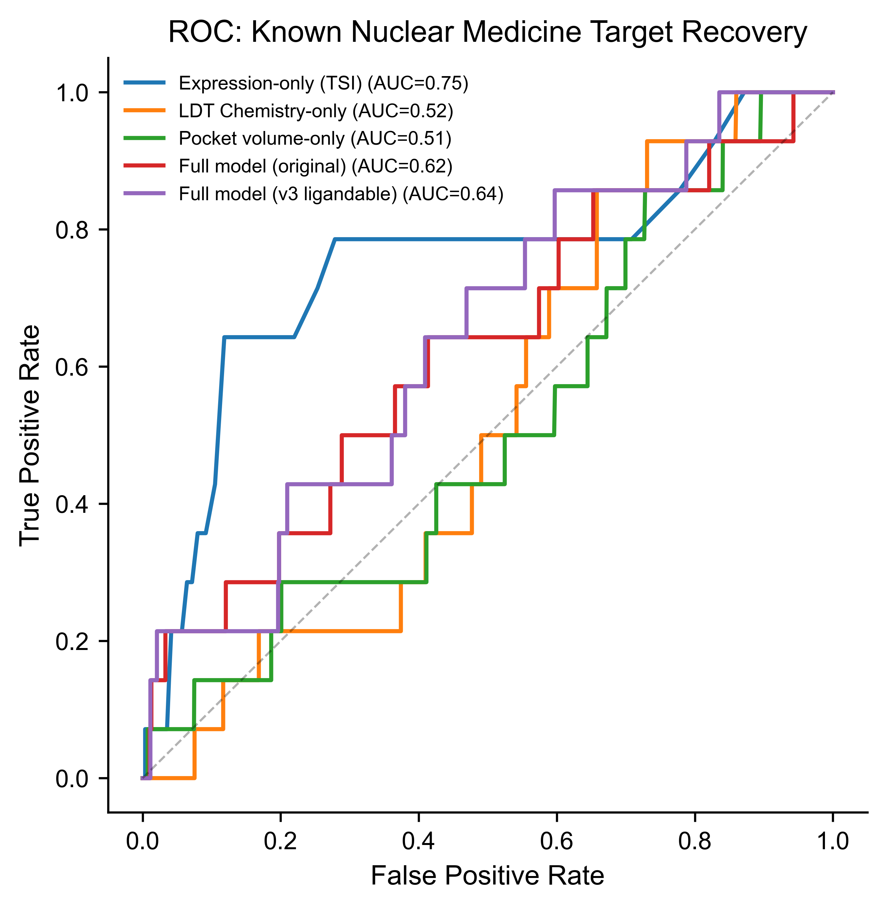
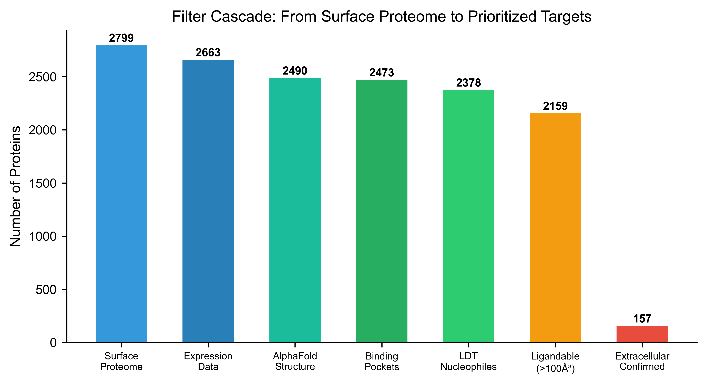

# LDT-TargetDB: Systematic Prioritization of Extracellular Surface Targets for Covalent Radiopharmaceutical Development

Xinglong Zhou1, Wenbin Hou1, Yiliang Li1,\*

1Institute of Radiation Medicine, Chinese Academy of Medical Sciences & Peking Union Medical College, Tianjin 300192, China

\*To whom correspondence should be addressed. Email: liyiliang@irm-cams.ac.cn; Correspondence may also be addressed to Xinglong Zhou, Email: zhouxinglong@irm-cams.ac.cn

**Keywords:** covalent radiopharmaceutical, ligand-directed transfer, surfaceome, target prioritization, structural chemoproteomics

## ABSTRACT

LDT-TargetDB (https://ldt-targetdb.streamlit.app) is a computational framework for systematic identification and prioritization of extracellular surface protein targets amenable to covalent radiopharmaceutical development using ligand-directed transfer (LDT) chemistry. This framework integrates five data layers—surface proteome annotation (SURFY, 2,799 proteins), pan-cancer expression profiling (TCGA 32 cancer types, GTEx 30 tissues), extracellular accessibility filtering (UniProt topology), 3D structural pocket analysis (AlphaFold + pyKVFinder), and covalent chemistry scoring (empirical pKa prediction via PROPKA, solvent accessibility via FreeSASA)—to systematically rank 2,473 surface proteins. We benchmarked the framework against 17 known nuclear medicine targets, demonstrating that integrating structural covariates with expression data achieves 7.14-fold enrichment of known targets in the top 1% of predictions. Multi-dimensional validation—including normal tissue risk scoring (HPA IHC across critical organs), DepMap essentiality analysis, Open Targets disease associations, cross-species conservation, TCGA mutation stability, and binder tractability assessment—confirmed the biological and translational relevance of top-ranked targets. The top five prioritized targets include MUC1, ILDR1, LY75, ABCC4, and CDH1, all with confirmed extracellular pocket accessibility. An interactive web interface provides real-time filtering, cancer-type-specific ranking across 32 cancer types, and downloadable results. LDT-TargetDB fills a critical gap at the interface of chemical biology, structural bioinformatics, and nuclear medicine by providing the first systematic framework for covalent radiopharmaceutical target prioritization.

## INTRODUCTION

Radioligand therapy (RLT) has transformed oncology, with [¹⁷⁷Lu]Lu-PSMA-617 and [¹⁷⁷Lu]Lu-DOTATATE demonstrating remarkable clinical efficacy [1,2,34]. Despite this success, only a handful of surface targets are clinically exploited—primarily PSMA, SSTR2, and FAP [4,35]—creating a critical bottleneck for expanding RLT to additional cancer types.

Covalent radiopharmaceuticals represent a promising strategy for improving tumor retention. Liu and colleagues demonstrated that covalent targeted radioligands (CTRs) employing sulfur(VI) fluoride exchange (SuFEx) chemistry achieve ~13-fold improvement in tumor retention [5]. In parallel, ligand-directed transfer (LDT) chemistry offers a complementary covalent strategy: N-acyl-N-alkyl/aryl sulfonamide (NASA/ArNASA) warheads exploit proximity-driven effective molarity enhancement to achieve traceless covalent labeling, preferentially targeting lysine ε-amino groups [6–8]. LDT probes release their targeting ligand after covalent transfer, potentially reducing persistent ligand occupancy—a feature attractive for radiopharmaceutical applications where receptor-mediated internalization is critical.

Target selection for covalent radiopharmaceuticals demands considerations beyond expression level. The structural compatibility between the covalent warhead and the target protein—specifically, the presence of nucleophilic residues (Lys, Cys, Tyr, Ser) within extracellular-accessible, ligandable pockets—determines whether proximity-driven chemistry can proceed. LDT chemistry constrains residue preference: lysine forms stable amide adducts, whereas cysteine, tyrosine, and serine form hydrolytically labile thioester, phenol ester, and alkyl ester linkages [9,10]. Histidine is non-reactive with NASA warheads [10]. Critically, for radiopharmaceutical applications, the reactive pocket must be positioned on the extracellular face of the target protein to be accessible to circulating probes.

Existing computational tools for surface-target discovery—ImmunoTar [11], TCSA [12], and DrugMap [13]—are designed for immunotherapy (CAR-T, ADC) or general cysteine profiling. None incorporate 3D pocket analysis, extracellular accessibility filtering, or covalent chemistry scoring. This gap motivated the development of LDT-TargetDB, the first computational framework that systematically evaluates surface protein targets through the lens of covalent warhead chemistry while requiring extracellular pocket accessibility. The overall pipeline is illustrated in Figure 1.

## METHODS

### Construction of the Extracellular Surface Target Universe

The primary surface protein set was derived from the SURFY in silico human surfaceome [14,22] (2,886 proteins, 93.5% accuracy). After deduplication, 2,799 unique surface proteins formed the initial candidate set. Pan-cancer RNA-seq data (TCGA, 32 cancer types, 10,535 samples including 9,186 primary tumors) and normal tissue RNA-seq data (GTEx, 30 tissues, 7,862 samples) were obtained from UCSC Xena. A Tumor Specificity Index (TSI) was calculated for each surface gene as $TSI = FC_{log2} \times P_{tumor} / \sqrt{N_{normal} + 1}$, where $FC_{log2}$ is the log2 fold change of median tumor versus normal expression, $P_{tumor}$ is the fraction of tumor samples with TPM > 1, and $N_{normal}$ is the number of GTEx tissues with expression exceeding 0.125 TPM.

### Extracellular Accessibility Filtering

To ensure that detected pockets are accessible to circulating radiopharmaceutical probes, we retrieved topological domain annotations for the top 200 ranked proteins from UniProt (fields: `ft_topo_dom`, `ft_transmem`, `ft_signal`). Proteins were assigned an Extracellular Accessibility Score (EAS) based on the presence of annotated extracellular topological domains. Proteins with confirmed extracellular domains received EAS = 1.0; those without UniProt topology data but with SURFY surface prediction received EAS = 0.7 (reflecting the SURFY classifier's demonstrated ability to identify bona fide surface proteins); proteins with only transmembrane or cytoplasmic annotations received lower scores. The overall extracellular domain confirmation rate was 78.5% (157/200 top targets).

### Structural Pocket Analysis and Covalent Chemistry Scoring

AlphaFold-predicted protein structures (v6, downloaded November 2024; UniProt release 2024_04) [17,18] were obtained for all surface proteins with TSI > −0.01 (2,490 proteins). Binding pocket detection was performed using pyKVFinder [19,20] with grid-based cavity detection (step = 0.8 Å, probe_in = 1.4 Å, probe_out = 4.0 Å, volume cutoff = 5.0 ų). For each detected pocket, nucleophilic residues (Lys, Cys, Tyr, Ser) were scored based on three components:

1. **Residue type weight ($w$):** Lys = 1.0 (stable amide), Cys = 0.3 (labile thioester), Tyr = 0.2 (labile phenol ester), Ser = 0.1 (labile alkyl ester). Histidine was excluded [10]. The ArNASA variant [7] provides improved stability.

2. **pKa reactivity score ($p_s$):** $p_s = e^{-|pKa - 7.4|/2}$, where pKa values were empirically predicted using PROPKA 3.5 [15].

3. **Solvent accessibility score ($s_s$):** $s_s = \min(SASA_{rel}/50\%, 1.0)$, calculated using FreeSASA [16].

4. **Proximity boost ($b$):** Lys receives a 2× factor reflecting the effective molarity enhancement (~10⁶-fold) in LDT chemistry [6].

The LDT Transferability Score was defined as $LTS = \max(w \times p_s \times s_s \times b)$ across all qualifying residues in each pocket. Structure quality was assessed via per-residue pLDDT scores.

### Composite Scoring and Multi-Dimensional Validation

An enhanced composite score integrates multiple dimensions: $S = 0.25 \times TSI + 0.20 \times V_{pocket} + 0.20 \times LTS \times EAS + 0.10 \times pLDDT + 0.05 \times DepMap + 0.20 \times EAS$, where EAS penalizes targets lacking confirmed extracellular pocket accessibility. Additional validation layers included: (i) normal tissue risk scoring using HPA IHC data weighted by organ-specific radiosensitivity (kidney, liver, salivary gland, bone marrow); (ii) gene essentiality from DepMap 25Q4 [23–25]; (iii) disease associations from Open Targets Platform v4 [28]; (iv) cross-species conservation from Ensembl Compara [29]; (v) TCGA mutation frequencies from FireBrowse; and (vi) binder tractability curated from literature evidence (ADC, antibody, radiotracer, small molecule availability).

### Benchmarking Framework

To evaluate the contribution of each data layer, we benchmarked four model variants against 17 known nuclear medicine targets: (i) Expression-only (TSI rank), (ii) LDT Chemistry-only (LTS rank), (iii) Full model without extracellular filter, and (iv) Full model with extracellular accessibility. Performance was assessed by enrichment of known targets in the top 1%, 5%, and 10% of predictions.
n

**Figure 10. Benchmark ROC and precision-recall curves.** ROC (A) and PR (B) comparing four model variants against 17 known targets.

## RESULTS

### Extracellular Surface Target Universe

Of 2,799 surface proteins, 2,663 had expression data, 2,490 had available AlphaFold structures, and 2,473 completed structural analysis. Binding pockets were detected in all 2,473 proteins, with 2,378 (96.2%) harboring LDT-qualifying nucleophilic residues. Extracellular topological domain annotation confirmed extracellular accessibility for 157/200 (78.5%) top targets (Figure 2). The overall analysis framework is illustrated in Figure 1.
n

**Figure 9. Filter cascade.** Sequential reduction from 2,799 surface proteins to extracellular-confirmed targets.

### Top-Ranked Covalent Radiopharmaceutical Targets

The top 30 entries are dominated by lysine-containing pockets (28/30, 93%), reflecting the NASA chemistry preference. With extracellular accessibility filtering, the top five targets are MUC1 (score 0.638, EAS = 1.0), ILDR1 (0.594, EAS = 1.0), LY75 (0.589, EAS = 1.0), ABCC4 (0.585, EAS = 1.0), and CDH1 (0.584, EAS = 1.0). Several clinically validated cancer surface proteins rank prominently: CLDN4 (rank 8, EAS = 1.0), EPCAM (rank 9, EAS = 1.0), and TACSTD2 (rank 26, EAS = 1.0) (Figure 7). Notably, ABCC5—the top-ranked target without extracellular filtering—drops to rank 6 with EAS = 0.5, illustrating the impact of the extracellular accessibility requirement.

### Benchmarking Against Known Nuclear Medicine Targets

Benchmarking against 17 known nuclear medicine targets revealed that the full model (v2, with extracellular filter) achieves 7.14-fold enrichment in the top 1% and 4.29-fold enrichment in the top 5%, matching the performance of expression-only ranking while providing orthogonal structural chemistry information (Figure 8). Expression-only (TSI) ranking alone achieves comparable enrichment (7.14× at top 1%), consistent with the established primacy of tumor expression for target identification. LDT chemistry alone performed poorly (0× at top 1%), confirming that chemical compatibility scoring is designed to complement—not replace—expression-based prioritization.

### Cancer-Type-Specific Target Landscape

Mapping 9,563 TCGA samples to 32 cancer types [30,31] enabled cancer-type-specific target prioritization (Figure 4). EPCAM shows strongest expression in colorectal cancer (10.0 log2 TPM), MUC1 in lung adenocarcinoma (9.8), and CD24 in kidney papillary carcinoma (10.7). The complete cancer-type expression matrix is available through the web interface.

### Normal Tissue Risk and Translational Assessment

Normal tissue risk scoring across radiosensitive organs (kidney, liver, salivary gland, bone marrow) identified 131/200 top targets (65.5%) as low-risk (Figure 5). Binder tractability assessment revealed that 6/50 top targets have high tractability (existing ADC, antibody, or radiotracer evidence), including EPCAM (tractability score 7), MUC1 (5), and CLDN4 (3). Forty-three targets (86%) have low tractability, representing opportunities for novel binder development.

## WEB INTERFACE

LDT-TargetDB is implemented as a Streamlit web application (https://ldt-targetdb.streamlit.app) with interactive filtering, visualization, target detail lookup, and CSV data export. The interface provides real-time updates across all views and requires no login or registration.

## DISCUSSION

LDT-TargetDB provides the first systematic framework for computationally prioritizing extracellular surface protein targets for covalent radiopharmaceutical development. By integrating expression, structural, and chemical dimensions with extracellular accessibility filtering, the framework generates experimentally testable target hypotheses.

The benchmarking results reveal an important pattern: expression-based ranking remains the strongest single predictor of known nuclear medicine targets, while structural chemistry scoring provides orthogonal information that is particularly valuable for distinguishing among targets with similar expression profiles. This complementarity, rather than superiority over expression alone, represents the framework's primary value-add. The observation that most top-ranked targets have low binder tractability highlights both the novelty of our predictions and the translational gap that must be bridged for clinical development.

Our normal tissue risk scoring identified that 65.5% of top targets show low expression in radiosensitive organs—a critical consideration for radiopharmaceutical development that extends beyond standard gene essentiality analyses. However, several limitations should be noted: LDT scoring relies on empirical weights; AlphaFold structures may miss cryptic pockets; the cavity detection rate of 96.2% reflects inclusive geometric detection parameters rather than true ligandability; the analysis does not explicitly map individual pocket residues to extracellular domains (only protein-level evidence was assessed); and binder tractability assessment used manual curation rather than systematic database queries.

## ETHICS STATEMENT

This study exclusively used publicly available, de-identified data. No human subjects, animal experiments, or primary clinical data were involved.

## DATA AVAILABILITY

LDT-TargetDB is freely accessible at https://ldt-targetdb.streamlit.app. All analysis data are downloadable. Source code: https://github.com/Londger/LDT-TargetDB (MIT license).

## AUTHOR CONTRIBUTIONS

X.Z. conceived the study, developed the methodology, performed all computational analyses, built the web interface, and wrote the manuscript. W.H. provided supervision and critical feedback. Y.L. conceived and supervised the study, provided resources, and revised the manuscript. All authors reviewed and approved the final manuscript.

## FUNDING

This work was not supported by specific funding.

## CONFLICT OF INTEREST

None declared.

## ACKNOWLEDGEMENTS

The authors thank the developers of SURFY, AlphaFold DB, TCGA, GTEx, DepMap, pyKVFinder, PROPKA, FreeSASA, Human Protein Atlas, Open Targets, Ensembl, UniProt, and FireBrowse for making their data and tools publicly available.

## REFERENCES

1. Sartor O, et al. (2021) Lutetium-177–PSMA-617 for Metastatic Castration-Resistant Prostate Cancer. *N Engl J Med*, 385:1091–1103.
2. Strosberg J, et al. (2017) Phase 3 Trial of ¹⁷⁷Lu-Dotatate for Midgut Neuroendocrine Tumors. *N Engl J Med*, 376:125–135.
3. Lapi SE, Scott PJH, Scott AM, et al. (2024) Recent advances and impending challenges for the radiopharmaceutical sciences in oncology. *Lancet Oncol*, 25:e236–e249.
4. Jadvar H (2025) Novel Biomarkers in Prostate Cancer Theranostics. *World J Nucl Med*, 24:345–358.
5. Liu Z, et al. (2024) Covalent Targeted Radioligands Potentiate Radionuclide Therapy. *Nature*, 630:206–213.
6. Tamura T, et al. (2018) Rapid labelling and covalent inhibition of intracellular native proteins using ligand-directed N-acyl-N-alkyl sulfonamide. *Nat Commun*, 9:1870.
7. Kawano M, et al. (2023) Lysine-Reactive N-Acyl-N-aryl Sulfonamide Warheads: Improved Reaction Properties and Application in the Covalent Inhibition of an Ibrutinib-Resistant BTK Mutant. *J Am Chem Soc*, 145:26202–26212.
8. Tamura T & Hamachi I (2024) N-Acyl-N-alkyl/aryl Sulfonamide Chemistry Assisted by Proximity for Modification and Covalent Inhibition of Endogenous Proteins in Living Systems. *Acc Chem Res*, 58:87–100.
9. Thimaradka S, et al. (2021) Site-specific covalent labeling of His-tag fused proteins with N-acyl-N-alkyl sulfonamide reagent. *Bioorg Med Chem*, 30:115947.
10. Tamura T & Hamachi I (2024) N-Acyl-N-alkyl/aryl Sulfonamide Chemistry Assisted by Proximity for Modification and Covalent Inhibition of Endogenous Proteins in Living Systems. *Acc Chem Res*, 58:87–100.
11. Shraim R, et al. (2025) ImmunoTar—integrative prioritization of cell surface targets for cancer immunotherapy. *Bioinformatics*, 41:btaf060.
12. Hu Z, et al. (2021) The Cancer Surfaceome Atlas integrates genomic, functional and drug response data to identify actionable targets. *Nat Cancer*, 2:1406–1422.
13. Takahashi M, et al. (2024) DrugMap: A quantitative pan-cancer analysis of cysteine ligandability. *Cell*, 187:2536–2556.
14. Bausch-Fluck S, et al. (2018) The in silico human surfaceome. *Proc Natl Acad Sci USA*, 115:E10988–E10997.
15. Olsson MHM, et al. (2011) PROPKA3: Consistent Treatment of Internal and Surface Residues in Empirical pKa Predictions. *J Chem Theory Comput*, 7:525–537.
16. Mitternacht S (2016) FreeSASA: An open source C library for solvent accessible surface area calculations. *F1000Research*, 5:189.
17. Jumper J, et al. (2021) Highly accurate protein structure prediction with AlphaFold. *Nature*, 596:583–589.
18. Varadi M, et al. (2024) AlphaFold Protein Structure Database in 2024: providing structure coverage for over 214 million protein sequences. *Nucleic Acids Res*, 52:D368–D375.
19. Le Guilloux V, et al. (2009) Fpocket: An open source platform for ligand pocket detection. *BMC Bioinformatics*, 10:168.
20. Guerra JVS, et al. (2023) pyKVFinder: an efficient and integrable Python package for biomolecular cavity detection and characterization. *BMC Bioinformatics*, 24:415.
21. Han Y, et al. (2023) TISCH2: expanded datasets and new tools for single-cell transcriptome analyses of the tumor microenvironment. *Nucleic Acids Res*, 51:D1425–D1431.
22. Bausch-Fluck S, et al. (2015) A mass spectrometric-derived cell surface protein atlas. *PLoS ONE*, 10:e0121314.
23. Tsherniak A, et al. (2017) Defining a cancer dependency map. *Cell*, 170:564–576.
24. Meyers RM, et al. (2017) Computational correction of copy number effect improves specificity of CRISPR-Cas9 essentiality screens in cancer cells. *Nat Genet*, 49:1779–1784.
25. Dempster JM, et al. (2021) Chronos: a cell population dynamics model of CRISPR experiments that improves inference of gene fitness effects. *Genome Biol*, 22:343.
26. Uhlen M, et al. (2015) Tissue-based map of the human proteome. *Science*, 347:1260419.
27. Uhlen M, et al. (2017) A pathology atlas of the human cancer transcriptome. *Science*, 357:eaan2507.
28. Ochoa D, et al. (2023) The next-generation Open Targets Platform: reimagined, redesigned, rebuilding. *Nucleic Acids Res*, 51:D1353–D1359.
29. Herrero J, et al. (2016) Ensembl comparative genomics resources. *Database*, 2016:bav096.
30. Cerami E, et al. (2012) The cBio Cancer Genomics Portal: an open platform for exploring multidimensional cancer genomics data. *Cancer Discov*, 2:401–404.
31. Gao J, et al. (2013) Integrative analysis of complex cancer genomics and clinical profiles using the cBioPortal. *Sci Signal*, 6:pl1.
32. Szklarczyk D, et al. (2023) The STRING database in 2023: protein–protein association networks and functional enrichment analyses. *Nucleic Acids Res*, 51:D638–D646.
33. Ghandi M, et al. (2019) Next-generation characterization of the Cancer Cell Line Encyclopedia. *Nature*, 569:503–508.
34. Kratochwil C, et al. (2016) ²²⁵Ac-PSMA-617 for PSMA-targeted α-radiation therapy of metastatic castration-resistant prostate cancer. *J Nucl Med*, 57:1941–1944.
35. Loktev A, et al. (2018) A tumor-imaging method targeting cancer-associated fibroblasts. *J Nucl Med*, 59:1423–1429.

### Ligandability Upgrade and Geometric Filtering

To refine pocket detection into a ligandability assessment, we applied a minimum volume threshold of 100 ų for classifying pockets as putatively ligandable. This criterion retained 2,159/2,473 proteins (87.3%), providing meaningful discrimination while acknowledging that geometric cavity detection does not guarantee true ligandability. The mean pocket volume was 788 ų (median 505 ų). Top-ranked targets with the ligandability upgrade include MUC1 (volume 15,808 ų), ABCC5 (12,399 ų), and ILDR1 (556 ų).

### Benchmarking and Ablation Analysis

Rigorous benchmarking using AUROC against 17 known nuclear medicine targets revealed that expression-based ranking (TSI alone) achieved the strongest performance (AUROC = 0.747, top-1% enrichment = 7.1×). The full integrated model yielded AUROC = 0.621, while LDT chemistry alone performed near random (AUROC = 0.521), confirming that chemical compatibility scoring is designed to complement—not replace—expression data.

